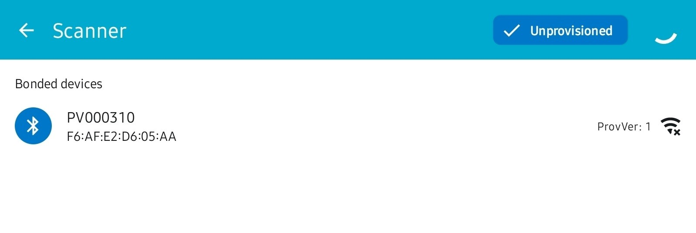
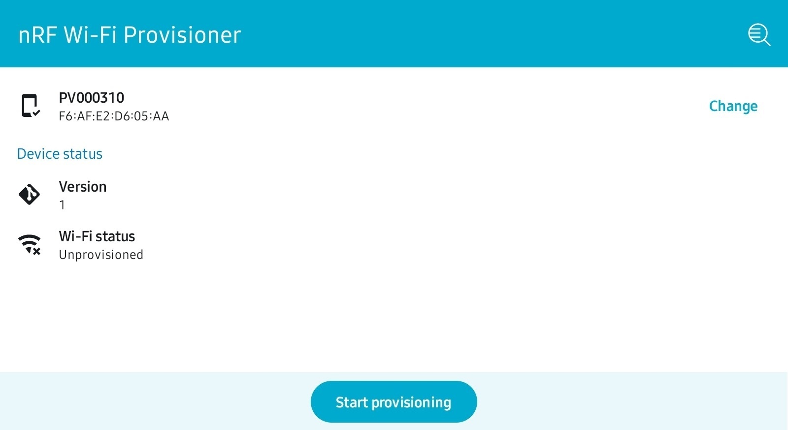
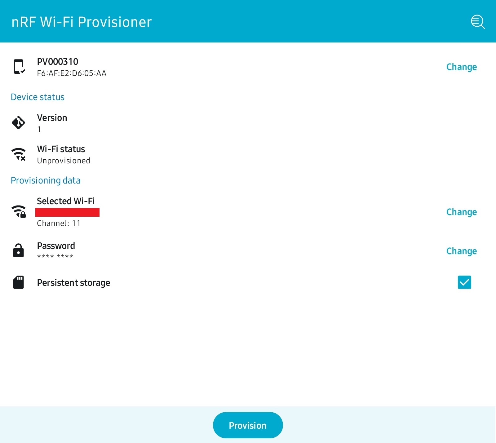
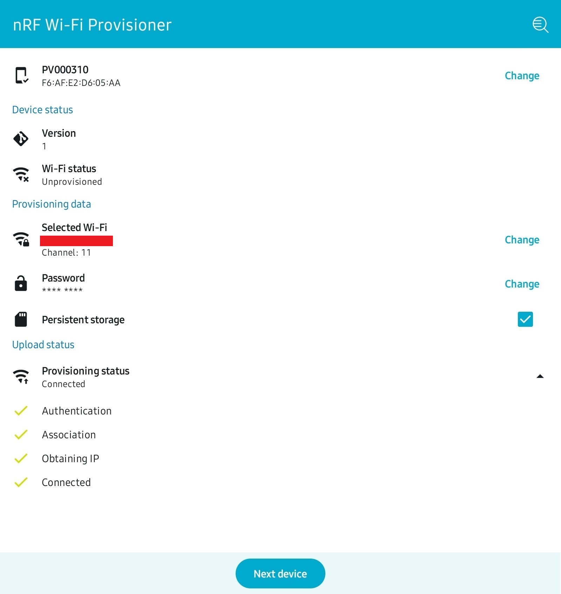
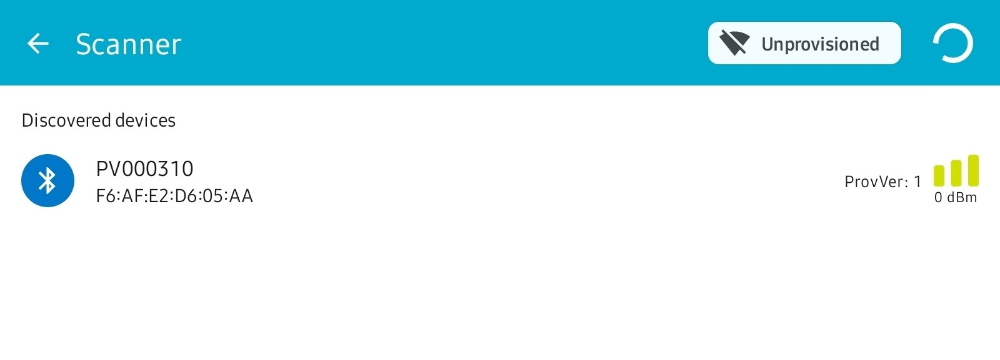
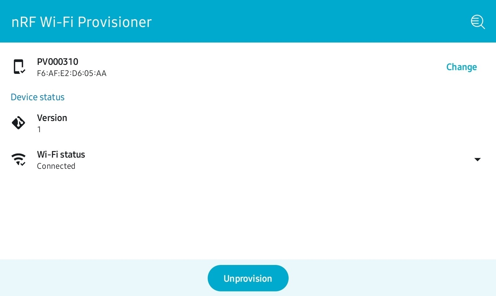
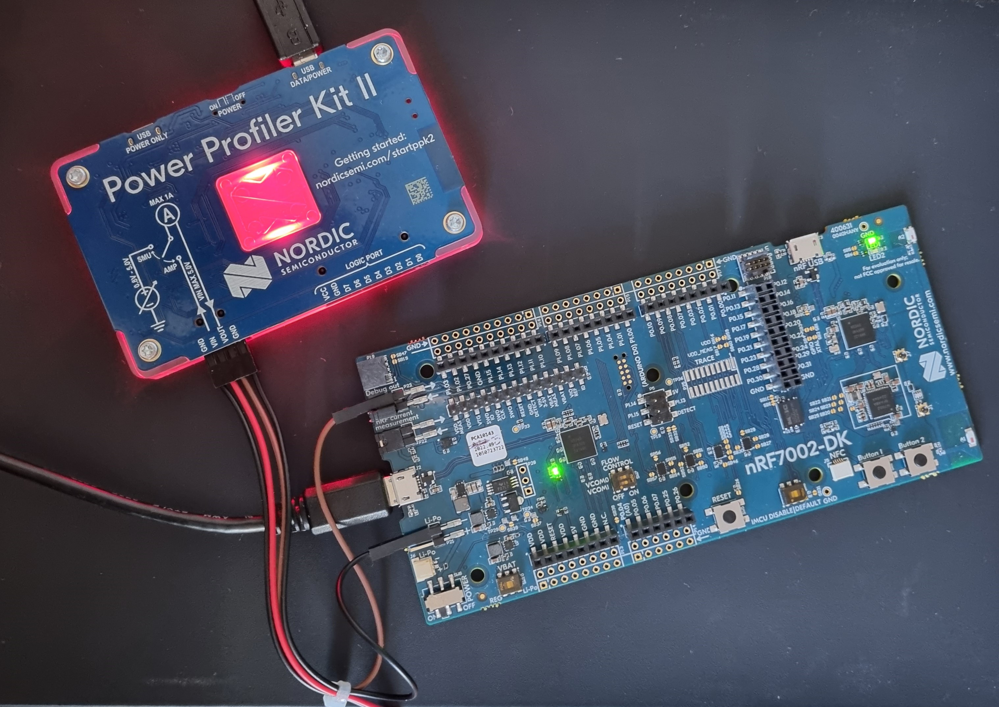
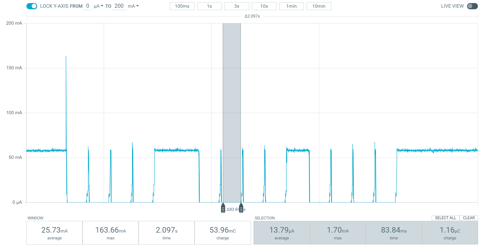

# Wi-Fi Provisioning Demo

<i> Based on [Wi-Fi: Provisioning Service](https://github.com/nrfconnect/sdk-nrf/tree/v2.2.0/samples/wifi/provisioning) in nRF Connect SDK v2.2.0 and [Rallare's Wi-Fi Provisioning demo](https://github.com/Rallare/fw-nrfconnect-nrf/tree/provisioning_demo_app/samples/wifi/provisioning).</i>

# Table of Contents
1. [Requirements](#requirements)
2. [Configuration](#configuration)
    1. [Provisioning](#provisioning)
    2. [Unprovision](#unprovision)
    3. [Current measurement](#current-measurement)
3. [User interface](#user-interface)
4. [Testing](#testing)
5. [Comments regarding power saving mode](#comments-regarding-power-saving-mode)
6. [Target Wake Time (TWT)](#target-wake-time-twt)

## Requirements
- nRF7002 DK (nrf7002dk_nrf5340_cpuapp)
- PPK2

You also need a phone or tablet with the nRF Wi-Fi Provisioner app ([Android](https://play.google.com/store/apps/details?id=no.nordicsemi.android.wifi.provisioning)|[Apple](https://apps.apple.com/gb/app/nrf-wi-fi-provisioner/id1638948698)), and a computer with the [Power Profiler app](https://www.nordicsemi.com/Products/Development-tools/nRF-Connect-for-Desktop).

<br>

## Configuration

### Provisioning
1. Turn the DK on, and wait 10 seconds for it to start up.
2. Open the nRF Wi-Fi Provisioner app and click <b>Start</b>.
3. Click on the device that shows up and select <b>Pair</b> in the pop up.

4. Click on <b>Start provisioning</b>.

5. Select the network you want to provision the device to and enter the network password.
6. Click on <b>Provision</b> to provision the device.

7. Wait a few seconds. When the device is provisioned you should see the following:


### Unprovision
1. Open the nRF Wi-Fi Provisioner app and click <b>Start</b>.
2. Unselect <b>Unprovisioned</b> in the upper right corner to get a list of provisioned devices. 

3. Click on the device you want to unprovision.
4. Click on <b>Unprovision</b>.

<br>
<br>

### Current measurement
<b>PPK2 setup</b>

Connect the PPK2 to the nRF7002 DK as shown in the picture:



| PPK2     | DK       |
| -------- | -------- |
| VOUT     | P23      |
| GND      | P21      |

<b>Power Profiler</b>
Select source meter mode, set supply voltage to 3.6 volt, and enable power output. 


## User interface 

<b>LED 1:</b> <br>
>Turns on when the device is in power saving mode.

<b>LED 2:</b>
>Turns on when button 2 is pressed to ping, and turns off after ping is complete.

<b>Button 1:</b>
>Enables/disables power saving mode.

<b>Button 2:</b>
>Sends ping.

## Testing

1. Set up PPK2 and Power Profiler as explained in [Current measurement](#current-measurement) and start current measurement.
2. Turn on and provision the DK as explained in [Provisioning](#provisioning).
3. Press button 1 to enable power saving mode. Pressing button 1 again will disable power saving.

## Comments regarding power saving mode
The power saving feature used by default in this demo is a legacy power saving mode, and thus the average current consumption will be higher than with Target Wake Time (TWT). The limiting factor is the time the device can be in low power mode. As seen in the picture below, the average current consumption is around 26 mA, while during low power mode the current consumption is around 14 µA. This can be improved by using TWT, as it allows for longer periods of low power mode, see [Target Wake Time (TWT)](#target-wake-time-twt).



## Target Wake Time (TWT)

This demo also has support for the Wi-Fi 6 feature Target Wake Time (TWT). To enable TWT set the ```CONFIG_WIFI_TWT_ENABLED``` Kconfig option. This will make the demo use TWT instead of legacy power saving. The user interface is the same as for power saving mode.

With TWT you can specify when and how frequently the device should wake up to send or receive data. This allows for the device to be in low power mode for much longer periods of time, thus greatly decreasing the average current consumption. In this demo, the default TWT interval, i.e. the expected average time between successive TWT wakeups, is by default 1 minute. This can be changed by changing the value of ```params.setup.twt_interval_ms``` in ```wifi_set_twt()```.

<i>NB: Few Wi-Fi 6 access points on the market have support for TWT as of now.</i>